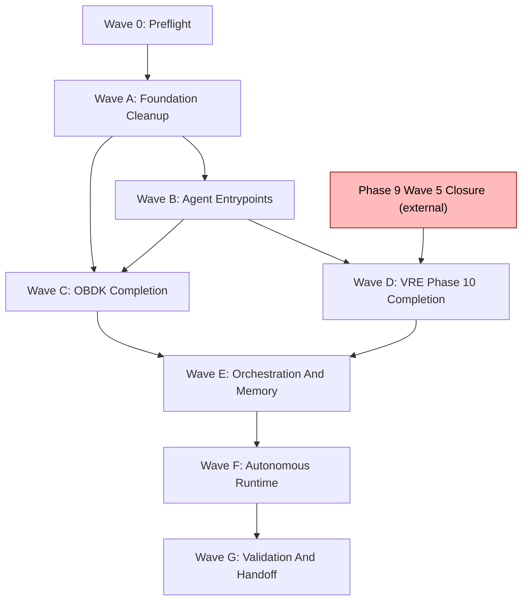

# Master Sequence
## Orthodox Mantra

**Il piano e il vangelo e noi siamo ortodossi che seguono il vangelo parola per parola.**

Every implementation step and every minimal variation must update the project wiki, implementation ledger, incremental changelog, relevant README, and GitHub remote, unless an operator-recorded waiver explicitly says otherwise.

## Purpose

Define the wave order, dependencies, parallel safety, and effort class for the integrated completion programme. The active wave at any moment is recorded in `Agentic_architect/ledger/active_wave.md` (created during Wave 0).

## Operational Workspace Binding

The plan source lives at `vibe-science/blueprints/private/integrated-system-claude-plan/`. The implementation workspace lives at `C:\Users\Test-User\Desktop\Tesi_Python_scRNA\nuove_skill\Agentic_architect`. Wave execution writes this plan's ledgers and reports to `Agentic_architect/ledger/` and `Agentic_architect/reports/`, then mirrors the plan source to `Agentic_architect/plan/` before commit and push.

## Wave Summary

| Wave | Name | Purpose | Cross-Wave Parallel-Safe | Within-Wave Parallelism | Effort Class | Closure Gate |
|---|---|---|---|---|---|---|
| 0 | Preflight | Verify state of OBDK/VRE/Vibe before any other wave; create ledgers | no (must run first) | sequential | S (1 session) | preflight report green |
| A | Foundation Cleanup | Mark experimental, ledgers, Cluster D v0.1 closure decision, stale prose sweep | no (blocks B/C/D) | A1-A4 parallel; A5 sequential gate | S (1 session) | clean recovery surface + operator decision on Cluster D |
| B | Agent Entrypoints | Make OBDK/VRE/Vibe discoverable to fresh agents | partly (with C) | B1-B4 parallel; B5-B6 verification/seed tasks; B7 sequential gate | M (2-3 sessions) | fresh-agent simulation + OBDK wiki seed pass |
| C | OBDK Completion | Complete OBDK as paper/method/script/analysis kernel | partly (with B and D) | C1-C9 parallel where independent; C10 sequential close | XL (10-15 sessions) | OBDK absorbability pre-gate report |
| D | VRE Phase 10 Completion | Complete Phase 10 researcher knowledge layer (HB-1 gated) | partly (with B and C, after Phase 9 Wave 5 closes) | D1 sequential gate first; D2-D7 parallel; D8 sequential close | XL (gated; size depends on Phase 9 Wave 5 closeout) | Phase 10 completion report green |
| E | Orchestration And Memory | Wire OBDK, VRE, Vibe Science into a single trace | no (after C and D both closed) | E1-E5 parallel where independent; E6 sequential close | M (3-5 sessions) | end-to-end trace query green |
| F | Autonomous Analysis Runtime | Paper-to-evidence loop + failure scenarios | partly (with G validation prep) | F1-F5 parallel; F6 sequential close | M (3-5 sessions) | one autonomous loop + one failure loop pass |
| G | Validation, Absorption, Handoff | Final validation, absorbability verdict, handoff | no (after F closed) | G1-G6 mostly sequential | M (2-3 sessions) | adversarial review ACCEPT + operator closure |

Total estimated effort: ~30-50 focused sessions. The XL waves (C and D) dominate.

## Dependency Graph



## Why This Order

- **Wave 0 first** because every other wave assumes ledgers and the active-wave pointer exist. Without Wave 0, agents either create ledgers ad-hoc (drift risk) or treat plan files as ledgers (incorrect).
- **Wave A second** because residual experimental files inside OBDK `.vibe-science/RQ-001-d0-first-cycle/` could confuse a fresh agent into thinking they are canonical. Marking them experimental is cheap and unblocks all downstream waves.
- **Wave B before C and D** because both C and D produce artifacts that fresh agents must discover; without entrypoints (SKILL.md, cross-system map), the artifacts are not findable.
- **Wave C and D parallel** because OBDK completion and Phase 10 completion are independent in their core work. They converge in Wave E. Note: Wave D is gated externally by Phase 9 Wave 5 closure; if not closed, Wave D pauses and Wave C continues.
- **Wave E after both C and D** because orchestration wires OBDK output to VRE memory; both subsystems must be ready.
- **Wave F after E** because autonomous runtime exercises the wired system; testing autonomy without orchestration would not validate the integrated system.
- **Wave G last** because final validation and handoff need all subsystems and their integration to be present.

## Stop Conditions

The current wave stops and operator is asked if:

- the wave's allowed write set is insufficient for a required action;
- a required source file does not exist on disk;
- a validation command cannot be run and no fallback evidence is possible;
- a hard boundary (HB-1..HB-13 from Phase 10 spec) conflicts with the action;
- the agent realizes a derailment pattern from `02_purpose_anchor.md`;
- the wave is Wave D and HB-1 (Phase 9 Wave 5 closure + operator GO) is not satisfied.

## Wave Closure Discipline

Closure follows the orthodox mantra: **il piano e il vangelo e noi siamo ortodossi che seguono il vangelo parola per parola.**

Each wave closes only when:

1. all atomic tasks in `16_atomic_task_backlog.md` for that wave are checked;
2. wave-specific tests in `17_test_strategy.md` pass;
3. evidence is recorded in `ledger/change_log.md`;
4. adversarial review is requested (if the wave changed system behavior, memory, orchestration, or agent autonomy) and the verdict is ACCEPT or ACCEPT_WITH_MINOR;
5. operator closure is recorded in `ledger/operator_decisions.md` for waves that change scope (specifically Wave A Cluster D decision, Wave D Phase 10 implementation track GO, Wave G handoff).
6. the orthodox update packet is complete for every task and every variation:
   - project wiki updated;
   - implementation ledger updated;
   - incremental changelog updated with exact files edited and why;
   - relevant README updated;
   - GitHub commit and push completed after review closure, or an operator-recorded waiver exists for that specific push.

The orthodox update packet is inherited by every wave file and every task row. A task that omits it is incomplete even if tests pass.

## Active Wave Pointer

The pointer lives at `Agentic_architect/ledger/active_wave.md`. Format:

```
active_wave: <wave_id>
since: <ISO 8601 timestamp>
last_updated_by: <agent identifier>
last_updated_reason: <short description>
```

The pointer must be updated atomically when a wave opens or closes. Multiple agents reading the pointer simultaneously must observe the same value (no torn writes).

## Commit Discipline

Recommended commit grouping:

1. one commit per wave setup;
2. one commit per implemented subsystem within a wave;
3. one commit per review-fix batch;
4. one final closure commit per wave.

Commit messages start with the wave id, e.g. `wave-a: archive overshoot surfaces`. The integrated plan folder commits are tagged `claude-plan/<wave>` to distinguish from sibling Codex plan commits tagged `codex-plan/<wave>`.

Every pushed commit must be traceable back to a wiki page, ledger row, changelog row, README delta, and verification command output. A local-only commit is not a closed implementation step unless the operator explicitly records a no-push waiver.

## Reconciliation With Sibling Codex Plan

This Claude plan and the sibling Codex plan must reconcile before either becomes canonical. Reconciliation happens via:

1. Codex performs adversarial review of this plan via `20_adversarial_review_packet.md`;
2. Claude performs adversarial review of sibling Codex plan via the equivalent packet there;
3. operator decides which plan or which merge becomes canonical;
4. losing plan moves to archive `vibe-science/blueprints/private/_archive/<plan-name>/` with README explaining the loss.

Until reconciliation is complete, neither plan is authorized for execution beyond Wave 0 (preflight is identical for both).
