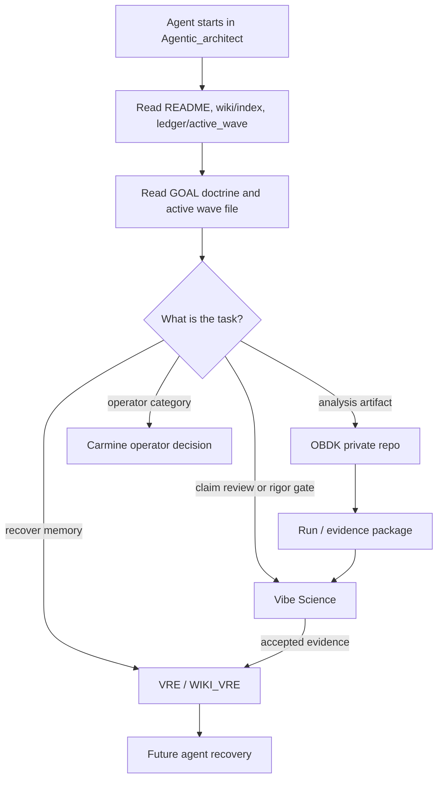

# System Orchestration Map

## Orthodox Mantra

**Il piano e il vangelo e noi siamo ortodossi che seguono il vangelo parola per parola.**

Every implementation step and every minimal variation must update the project wiki, implementation ledger, incremental changelog, relevant README, and GitHub remote, unless an operator-recorded waiver explicitly says otherwise.

## Purpose

This map explains how a fresh agent routes work across Agentic Architect, OBDK, VRE, and Vibe Science without chat history. It is an execution map for the integrated system, not a new scope layer.

## Startup To Evidence Flow

## Decision Table

| Need | Use | Current status | Escalate when |
|---|---|---|---|
| Find active wave and next task | Agentic Architect ledger + plan mirror | implemented | active wave missing or contradictory |
| Understand final project objective | `23_project_goal_and_implementation_doctrine.md` | implemented | objective change proposed |
| Validate or run OBDK contracts/recipes | OBDK CLI | implemented for `contracts`, `run`, `harvest-geo` | contract scope change or claim promotion |
| Ingest paper and extract methods | OBDK | planned Wave C | needed before Wave C closure |
| Persist evidence to durable memory | VRE / Phase 10 | planned Wave D/E | Phase 9 Wave 5 closure or Phase 10 gate unclear |
| Review claim, uncertainty, or negative result | Vibe Science | rigor layer available | gate relaxation or claim promotion requested |
| Store long-term sources, methods, runs, reviews | VRE wiki and Phase 10 knowledge layer | VRE wiki exists; Phase 10 implementation pending | missing page, conflicting memory, HB-1 not satisfied |
| Decide public/private boundary | Operator | operator-only | any public export or no-push waiver |

## Failure Fallback Table

| Failure | First action | Fallback | Do not do |
|---|---|---|---|
| Missing OBDK script | Check OBDK `SKILL.md`, `wiki/scripts.md`, and active wave | If script is Wave C planned, record gap and wait for Wave C | Do not invent hidden CLI commands |
| Missing VRE page | Read `WIKI_VRE/index.md` and `PROTOCOL-wiki-integrated-implementation.md` | Record missing page in active report and route to Wave D/E | Do not rely on chat memory |
| Vibe gate failure | Read gate verdict and failure category | Patch artifact through adversarial review | Do not call fixture smoke evidence a real result |
| Conflicting memories | Prefer disk ledger/wiki over chat; read operator decisions | Escalate if conflict changes scope or claim status | Do not reconcile silently |
| Phase 10 not implemented | Treat VRE Phase 10 functions as pending Wave D | Use smoke fallback and record limitation | Do not claim full VRE persistence |
| GitHub push fails | Stop closure and follow no-push waiver procedure | Operator decides waiver or retry | Do not treat failed push as waiver |

## ID And Backlink Rules

| ID | Format | Lives in | Backlinks to |
|---|---|---|---|
| `source_id` | `SRC-<short-source>-<YYYYMMDD>` | VRE source page or OBDK ingest output | paper/PDF/provenance |
| `method_id` | `MTH-<source-id>-<short-method>` | OBDK method extraction output | source_id |
| `script_id` | `SCR-<domain>-<short-purpose>-v<version>` | OBDK script registry after Wave C | method_id and contract ids |
| `run_id` | `RUN-<source-or-recipe>-<YYYYMMDD>-<purpose>` | OBDK `runs/` and reports | recipe/script/source |
| `evidence_id` | `EVD-<source-or-run>-<purpose>` | evidence package | run_id and validation ladder |
| `review_id` | `REV-<wave-or-claim>-<reviewer>-<seq>` | Agentic ledger or Vibe review packet | evidence_id and operator decision |
| `operator_decision_id` | `OPDEC-<wave>-<seq>-<short-name>` | `ledger/operator_decisions.md` | affected wave/task/report |

Every generated artifact must include at least one upstream ID and one downstream backlink target. If the ID cannot be assigned, the agent records the reason in the active report and stops before closure.

## Dual-Repo Commit Rule

When a task touches OBDK and Agentic Architect:

1. Commit and push OBDK private changes first when Agentic records depend on OBDK SHA evidence.
2. Record the OBDK SHA in Agentic ledger/wiki/report.
3. Commit and push Agentic Architect second.
4. Do not close the task until both local and remote SHAs match, unless Carmine records a no-push waiver.

## Current Wave B Note

Wave B creates entrypoints. It does not implement Wave C paper-ingest, method-extract, script-generation, or VRE export capability. Those names may appear only as planned surfaces.
